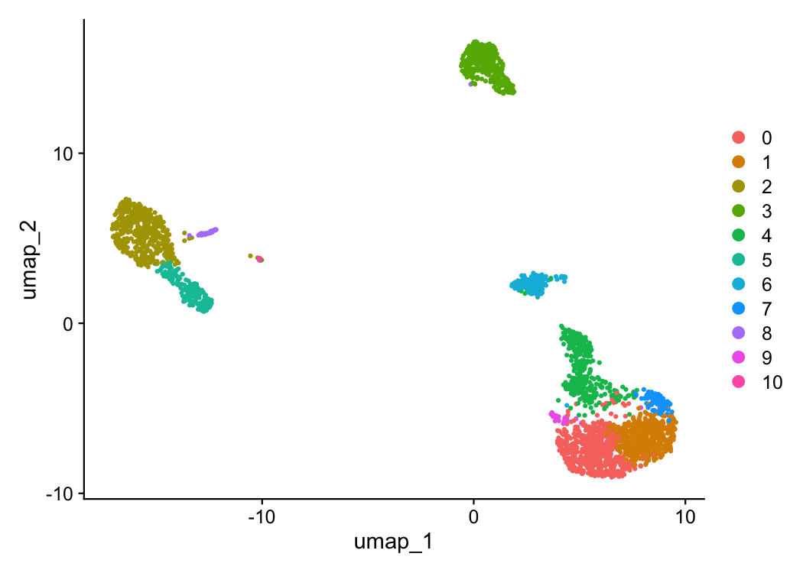
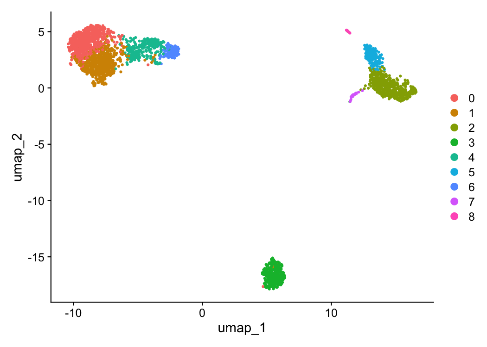

# Getting started with BigSur

## What is BigSur?

BigSur (Basic Informatics and Gene Statistics from Unnormalized Reads)
is a program which adjusts common statistics to account for the
over-dispersed structure of scRNA-seq data and allows for the principled
estimation of their respective p-values.

This has been implemented to:

1.  Calculate and statistically evaluate a modified corrected Fano
    factor for use in feature selection.

2.  Calculate and statistically evaluate a modified corrected Pearson
    correlation coefficient to analyze gene-gene correlations.

This tutorial will take you through a step-by-step tutorial of how to
use both the feature selection and correlation calculation features of
BigSur using the PBMC 2k dataset from 10X Genomics.

## Feature selection and clustering with the modified corrected Fano factor.

First, let’s load the libraries and data that we’ll be using.

``` r

library(Seurat)
#> Warning: package 'Seurat' was built under R version 4.3.3
#> Loading required package: SeuratObject
#> Warning: package 'SeuratObject' was built under R version 4.3.3
#> Loading required package: sp
#> Warning: package 'sp' was built under R version 4.3.3
#> Registered S3 method overwritten by 'future':
#>   method               from      
#>   all.equal.connection parallelly
#> 
#> Attaching package: 'SeuratObject'
#> The following objects are masked from 'package:base':
#> 
#>     intersect, t
library(BigSur)

#Load PBMC dataset and create Seurat object. We'll stick to the parameters used for the Seurat tutorial. The following code will download the data to a temporary file path and convert it into a Seurat object.
data.dir <- file.path(tempdir(), "pbmc3k")
if (!dir.exists(data.dir)) {
  url <- "https://cf.10xgenomics.com/samples/cell/pbmc3k/pbmc3k_filtered_gene_bc_matrices.tar.gz"
  tf <- tempfile(fileext = ".tar.gz")
  download.file(url, tf)
  untar(tf, exdir = data.dir)
}
pbmc_data <- Read10X(file.path(data.dir, "filtered_gene_bc_matrices/hg19"))
pbmc <- CreateSeuratObject(pbmc_data)
#> Warning: Feature names cannot have underscores ('_'), replacing with dashes
#> ('-')
pbmc[["percent.mt"]] <- PercentageFeatureSet(pbmc, pattern = "^MT-")
pbmc <- subset(pbmc, subset = nFeature_RNA > 200 & nFeature_RNA < 2500 & percent.mt < 5)

#We need to also remove any genes with 0 UMI counts.
counts <- Seurat::GetAssayData(pbmc, assay = "RNA", layer = "counts")
keep_genes <- Matrix::rowSums(counts) > 0
pbmc <- subset(pbmc, features = names(keep_genes[keep_genes]))
```

The most commonly utilized feature selection methods implemented in R
(Seurat’s FindVariableFeatures function and SCTransform) return a set
number of features to be used in clustering. This is fine in the case
where cell states are well separated from one another, but can add
substantial noise when trying to separate more subtly different ones.
BigSur implements statistical thresholding to remove genes which do not
have sufficient evidence of truly varying between cells.

The two most important parameters for modified corrected Fano
factor-based feature selection are fano.alpha and min.fano.

*fano.alpha* determines the adjusted p-value threshold above which a
gene will not be selected. *min.fano* is the minimum value of the
modified corrected Fano factor below which a gene will not be selected.

These two parameters allow you to tune the number of features that will
be used for analysis. p-value thresholding is very sensitive to
deviations from the null value of one, mostly removing very lowly
expressed genes from consideration. It can be paired with a Fano
threshold to further prune the number of features.

Let’s start with the default values (fano.alpha = 0.05, min.fano = 1.0):

``` r

pbmc_BS <- BigSur(pbmc, min.fano=1, fano.alpha = 0.05)
#> [1] "Modified corrected Pearson residuals calculated."
#> [1] "Modified corrected Fano factors calculated."
#> [1] "Beginning identification of significant mcFanos."
#> [1] "Highly variable features identified."
#> [1] "Pipeline complete."
```

We can check the modified corrected Fano factors and their respective
p-values for each gene.

``` r

mcfanos <- pbmc_BS@assays$RNA@meta.data$mcfanos
mcfanoPvals <- pbmc_BS@assays$RNA@meta.data$BH.Corrected.Pvalue
genes <- rownames(pbmc_BS)

df <- data.frame(
  Gene <- genes,
  mcFano <- mcfanos,
  Adj.Pval <- mcfanoPvals
)

df_sorted <- df[order(df$mcFano, decreasing=T), ]
head(df_sorted, n=20)
#>       Gene....genes mcFano....mcfanos Adj.Pval....mcfanoPvals
#> 4023           PPBP          94.68106            0.000000e+00
#> 16018         ARVCF          74.75694           1.207540e-246
#> 4798   CTB-113I20.2          58.72662           3.715856e-211
#> 8346          GBGT1          53.13703           2.427013e-255
#> 13768         YPEL2          52.31760           5.906283e-307
#> 14623       FAM210B          51.20144            0.000000e+00
#> 700          LRRIQ3          50.99809           5.789617e-196
#> 9223        MICALCL          49.62680           2.850233e-186
#> 6173         UBE2D4          46.41779           5.237942e-280
#> 6383           GJC3          44.85448           1.829023e-148
#> 11558          TTC8          42.88400           5.091287e-164
#> 15448          EID2          42.68005           9.289739e-214
#> 5046           DOK3          40.86849           3.010917e-275
#> 5275       HIST1H1B          39.79304           1.829697e-185
#> 9691         PGM2L1          39.05957           1.531779e-240
#> 2723          GMPPA          38.69322           1.216680e-294
#> 4007            IGJ          38.66830            0.000000e+00
#> 2005          MTIF2          35.95522           1.119633e-250
#> 4022            PF4          35.52469            0.000000e+00
#> 4495          MOCS2          35.52317           3.170730e-293
```

Genes which met the thresholding criteria will be stored in the typical
variable features slot. Let’s see how many there are.

``` r

length(VariableFeatures(pbmc_BS))
#> [1] 2734
```

Now let’s try with a more strict minimum Fano threshold.

``` r

pbmc_BS <- BigSur(pbmc, min.fano=1.3, fano.alpha=0.05)
#> [1] "Modified corrected Pearson residuals calculated."
#> [1] "Modified corrected Fano factors calculated."
#> [1] "Beginning identification of significant mcFanos."
#> [1] "Highly variable features identified."
#> [1] "Pipeline complete."
length(VariableFeatures(pbmc_BS))
#> [1] 2552
```

We can use these features to cluster and plot cells in the typical
manner. Here, we will also demonstrate that the modified-corrected
Pearson residuals can be used in place of log-normalized counts for this
purpose. They will automatically be stored in the same slot as is you
had run NormalizeData.

``` r

pbmc_BS <- ScaleData(pbmc_BS)
#> Centering and scaling data matrix
pbmc_BS <- RunPCA(pbmc_BS)
#> PC_ 1 
#> Positive:  CD3D, IL32, PTPRCAP, LDHB, CD3E, LTB, CXCR4, CD7, IL7R, GZMM 
#>     AES, CCR7, ISG20, CD69, JUN, EIF4A2, RHOH, CCL5, GLTSCR2, GZMA 
#>     CTSW, BIN1, SEPT7, NKG7, RARRES3, NOSIP, CD8B, TMEM66, CD27, CD2 
#> Negative:  FTL, CST3, FTH1, TYROBP, AIF1, LGALS1, LYZ, FCER1G, LST1, S100A6 
#>     COTL1, CD68, TYMP, SAT1, CFD, PSAP, CTSS, FCN1, SERPINA1, S100A11 
#>     IFITM3, AP1S2, CFP, S100A9, SPI1, S100A8, CD14, RP11-290F20.3, LGALS2, GSTP1 
#> PC_ 2 
#> Positive:  NKG7, GZMA, PRF1, GZMB, GNLY, SPON2, FGFBP2, GZMM, CTSW, KLRD1 
#>     CCL5, CST7, GZMH, S1PR5, CLIC3, AKR1C3, PRSS23, IL2RB, MATK, FCGR3A 
#>     ITGB2, XCL2, CD247, HOPX, GPR56, TBX21, C1orf21, SH2D1B, APMAP, CD99 
#> Negative:  CD74, HLA-DRA, HLA-DQB1, MS4A1, HLA-DQA1, CD79B, HLA-DPB1, HLA-DRB1, HLA-DQA2, CD79A 
#>     VPREB3, HLA-DPA1, HLA-DRB5, TCL1A, FCER2, CD37, BANK1, HLA-DOB, LINC00926, TSPAN13 
#>     GNG7, PKIG, CD72, SPIB, PPAPDC1B, PNOC, BLK, MARCH1, CD19, CYB561A3 
#> PC_ 3 
#> Positive:  LDHB, CD3D, IL7R, CD3E, NOSIP, SOCS3, S100A6, S100A9, S100A8, CCR7 
#>     TCF7, IL32, CD40LG, TMEM66, LYZ, S100A10, FHIT, LEPROTL1, GIMAP1, OXNAD1 
#>     CD14, CD27, FTL, JUN, GIMAP4, FCN1, CD5, CD44, CD2, C6orf48 
#> Negative:  PDLIM1, CD74, GNG11, SDPR, PF4, PPBP, HLA-DRA, SPARC, AP001189.4, TPM4 
#>     CD79B, MS4A1, HLA-DQB1, NRGN, HIST1H2BK, GP9, RGS18, HLA-DQA1, HLA-DPB1, HLA-DRB1 
#>     GPX1, RUFY1, TUBB1, PGRMC1, HLA-DQA2, CLU, HIST1H2AC, ILK, ITGA2B, HLA-DPA1 
#> PC_ 4 
#> Positive:  CD74, NKG7, HLA-DRA, HLA-DRB1, HLA-DPB1, GZMB, PRF1, HLA-DPA1, GNLY, HLA-DQB1 
#>     GZMA, SPON2, HLA-DQA1, CD79B, FGFBP2, HLA-DRB5, MS4A1, HLA-DQA2, PLAC8, KLRD1 
#>     CD79A, CLIC3, AKR1C3, VPREB3, CST7, S1PR5, CTSW, PRSS23, TCL1A, GZMH 
#> Negative:  GNG11, PPBP, PF4, SDPR, GPX1, SPARC, AP001189.4, NRGN, RGS18, GP9 
#>     TUBB1, RUFY1, RGS10, CLU, ITGA2B, TUBA4A, TPM4, PGRMC1, NGFRAP1, SEPT5 
#>     F13A1, CD9, HIST1H2AC, TPM1, GP1BA, SNCA, LY6G6F, MPP1, CMTM5, CA2 
#> PC_ 5 
#> Positive:  S100A9, S100A8, LYZ, CD14, CSF3R, GPX1, LGALS2, GSTP1, CEBPD, QPCT 
#>     VCAN, GRN, ID1, AP1S2, S100A12, RBP7, FCN1, FOLR3, NCF1, MS4A6A 
#>     C19orf59, CCL3, IL8, FCGR1A, IER3, CD99, PLBD1, LY86, NFKBIA, OSM 
#> Negative:  FCGR3A, RHOC, IFITM2, RP11-290F20.3, MS4A7, LST1, HMOX1, TIMP1, LILRA3, FCER1G 
#>     IFITM3, PILRA, COTL1, AIF1, FAM110A, SERPINA1, BID, STXBP2, CTD-2006K23.1, PPM1N 
#>     LILRB2, CEBPB, LYN, WARS, SPI1, FAM26F, ADA, NAP1L1, DRAP1, CTSC
set.seed(117)
pbmc_BS <- FindNeighbors(object = pbmc_BS, dims = 1:20)
#> Computing nearest neighbor graph
#> Warning: package 'future' was built under R version 4.3.3
#> Computing SNN
pbmc_BS <- FindClusters(object = pbmc_BS, resolution=0.9)
#> Modularity Optimizer version 1.3.0 by Ludo Waltman and Nees Jan van Eck
#> 
#> Number of nodes: 2638
#> Number of edges: 109513
#> 
#> Running Louvain algorithm...
#> Maximum modularity in 10 random starts: 0.8100
#> Number of communities: 11
#> Elapsed time: 0 seconds
pbmc_BS <- RunUMAP(object = pbmc_BS, dims = 1:20)
#> Warning: The default method for RunUMAP has changed from calling Python UMAP via reticulate to the R-native UWOT using the cosine metric
#> To use Python UMAP via reticulate, set umap.method to 'umap-learn' and metric to 'correlation'
#> This message will be shown once per session
#> 14:42:27 UMAP embedding parameters a = 0.9922 b = 1.112
#> 14:42:27 Read 2638 rows and found 20 numeric columns
#> 14:42:27 Using Annoy for neighbor search, n_neighbors = 30
#> 14:42:27 Building Annoy index with metric = cosine, n_trees = 50
#> 0%   10   20   30   40   50   60   70   80   90   100%
#> [----|----|----|----|----|----|----|----|----|----|
#> **************************************************|
#> 14:42:27 Writing NN index file to temp file /var/folders/5x/lylfytj53nnc4113k2v1khh80000gn/T//RtmpSqZGTT/file27954bcae635
#> 14:42:27 Searching Annoy index using 1 thread, search_k = 3000
#> 14:42:27 Annoy recall = 100%
#> 14:42:27 Commencing smooth kNN distance calibration using 1 thread with target n_neighbors = 30
#> 14:42:28 Initializing from normalized Laplacian + noise (using RSpectra)
#> 14:42:28 Commencing optimization for 500 epochs, with 109526 positive edges
#> 14:42:28 Using rng type: pcg
#> 14:42:30 Optimization finished
DimPlot(object = pbmc_BS, reduction = "umap")
```

 Let’s
compare this to what we get using the standard feature selection
approach.

``` r

pbmc <- NormalizeData(object = pbmc)
#> Normalizing layer: counts
pbmc <- FindVariableFeatures(object = pbmc)
#> Finding variable features for layer counts
pbmc <- ScaleData(object = pbmc)
#> Centering and scaling data matrix
pbmc <- RunPCA(object = pbmc)
#> PC_ 1 
#> Positive:  CST3, TYROBP, LST1, AIF1, FTL, FTH1, LYZ, FCN1, S100A9, TYMP 
#>     FCER1G, CFD, LGALS1, CTSS, S100A8, LGALS2, SERPINA1, IFITM3, SPI1, CFP 
#>     PSAP, IFI30, SAT1, COTL1, S100A11, NPC2, LGALS3, GSTP1, PYCARD, NCF2 
#> Negative:  MALAT1, LTB, IL32, IL7R, CD2, B2M, ACAP1, STK17A, CTSW, CD247 
#>     GIMAP5, AQP3, CCL5, TRAF3IP3, GZMA, CST7, MAL, ITM2A, HOPX, MYC 
#>     GIMAP7, BEX2, LDLRAP1, GZMK, ETS1, ZAP70, TNFAIP8, RIC3, LYAR, SAMD3 
#> PC_ 2 
#> Positive:  CD79A, MS4A1, TCL1A, HLA-DQA1, HLA-DQB1, HLA-DRA, LINC00926, CD79B, HLA-DRB1, CD74 
#>     HLA-DMA, HLA-DPB1, HLA-DQA2, HLA-DRB5, HLA-DPA1, HLA-DMB, FCRLA, HVCN1, LTB, BLNK 
#>     P2RX5, IGLL5, IRF8, SWAP70, ARHGAP24, SMIM14, PPP1R14A, C16orf74, MZB1, RP11-428G5.5 
#> Negative:  NKG7, PRF1, CST7, GZMB, GZMA, FGFBP2, CTSW, GNLY, B2M, SPON2 
#>     GZMH, CCL4, FCGR3A, CCL5, CD247, XCL2, CLIC3, AKR1C3, SRGN, HOPX 
#>     TTC38, CTSC, S100A4, IGFBP7, ANXA1, ID2, IL32, XCL1, ACTB, APOBEC3G 
#> PC_ 3 
#> Positive:  HLA-DQA1, CD79A, CD79B, HLA-DQB1, HLA-DPA1, HLA-DPB1, CD74, MS4A1, HLA-DRB1, HLA-DRA 
#>     HLA-DRB5, HLA-DQA2, TCL1A, LINC00926, HLA-DMB, HLA-DMA, HVCN1, MALAT1, FCRLA, IRF8 
#>     PLAC8, BLNK, SMIM14, PLD4, P2RX5, LAT2, IGLL5, SWAP70, ARHGAP24, FGFBP2 
#> Negative:  PPBP, PF4, SDPR, SPARC, GNG11, NRGN, GP9, RGS18, TUBB1, HIST1H2AC 
#>     CLU, AP001189.4, ITGA2B, CD9, TMEM40, PTCRA, CA2, ACRBP, MMD, TREML1 
#>     F13A1, NGFRAP1, SEPT5, RUFY1, TSC22D1, MPP1, CMTM5, MYL9, RP11-367G6.3, GP1BA 
#> PC_ 4 
#> Positive:  HLA-DQA1, CD79A, CD79B, HLA-DQB1, MS4A1, CD74, HLA-DPB1, HLA-DPA1, HLA-DRB1, TCL1A 
#>     HLA-DQA2, HLA-DRA, LINC00926, HLA-DRB5, GZMB, HIST1H2AC, HLA-DMA, HVCN1, HLA-DMB, FCRLA 
#>     PF4, SDPR, FGFBP2, FCGR3A, PPBP, GNG11, PRF1, NKG7, PLAC8, GNLY 
#> Negative:  VIM, IL7R, S100A6, S100A8, IL32, S100A4, GIMAP7, S100A9, S100A10, MAL 
#>     AQP3, FYB, CD2, CD14, GIMAP4, LGALS2, ANXA1, RBP7, FCN1, S100A12 
#>     LYZ, TMSB4X, GIMAP5, S100A11, MS4A6A, FOLR3, TRABD2A, AIF1, IL8, NELL2 
#> PC_ 5 
#> Positive:  GZMB, FGFBP2, NKG7, S100A8, GNLY, CCL4, CST7, PRF1, GZMA, SPON2 
#>     GZMH, S100A9, CCL3, LGALS2, CTSW, XCL2, CLIC3, S100A12, CCL5, RBP7 
#>     CD14, MS4A6A, GSTP1, AKR1C3, IGFBP7, TYROBP, TTC38, FOLR3, XCL1, HOPX 
#> Negative:  LTB, IL7R, VIM, CKB, AQP3, MS4A7, CYTIP, RP11-290F20.3, SIGLEC10, HMOX1 
#>     PTGES3, MAL, HN1, CD2, LILRB2, GDI2, CORO1B, ANXA5, TUBA1B, FAM110A 
#>     PPA1, TRADD, ATP1A1, ABRACL, IL32, FYB, WARS, CTD-2006K23.1, TRAF3IP3, GPR183
set.seed(117)
pbmc <- FindNeighbors(object = pbmc, dims = 1:30)
#> Computing nearest neighbor graph
#> Computing SNN
pbmc <- FindClusters(object = pbmc)
#> Modularity Optimizer version 1.3.0 by Ludo Waltman and Nees Jan van Eck
#> 
#> Number of nodes: 2638
#> Number of edges: 142213
#> 
#> Running Louvain algorithm...
#> Maximum modularity in 10 random starts: 0.8106
#> Number of communities: 9
#> Elapsed time: 0 seconds
pbmc <- RunUMAP(object = pbmc, dims = 1:30)
#> 14:42:36 UMAP embedding parameters a = 0.9922 b = 1.112
#> 14:42:36 Read 2638 rows and found 30 numeric columns
#> 14:42:36 Using Annoy for neighbor search, n_neighbors = 30
#> 14:42:36 Building Annoy index with metric = cosine, n_trees = 50
#> 0%   10   20   30   40   50   60   70   80   90   100%
#> [----|----|----|----|----|----|----|----|----|----|
#> **************************************************|
#> 14:42:37 Writing NN index file to temp file /var/folders/5x/lylfytj53nnc4113k2v1khh80000gn/T//RtmpSqZGTT/file27953ad0ae03
#> 14:42:37 Searching Annoy index using 1 thread, search_k = 3000
#> 14:42:37 Annoy recall = 100%
#> 14:42:37 Commencing smooth kNN distance calibration using 1 thread with target n_neighbors = 30
#> 14:42:37 Initializing from normalized Laplacian + noise (using RSpectra)
#> 14:42:37 Commencing optimization for 500 epochs, with 109698 positive edges
#> 14:42:37 Using rng type: pcg
#> 14:42:40 Optimization finished
DimPlot(object = pbmc, reduction = "umap")
```

 In this
case, we have very well defined differences between our cell states
meaning the feature selection method used will have very little impact
on the output clusters and dimensionality reduction. Still, we are able
to pull a few cells out into their own distinct clusters in UMAP space
that were missed with the standard approach.

## Correlation Analysis with BigSur

Genes involved in the same or related regulatory pathways are expected
to correlate in their expression with one another on average (barring
those with large time delays in their activation). Because scRNA-seq
data contains many cells which can be estimated to be ergodic, it
provides a theoretically sound platform to profile regulatory activity
through correlation calculations. However, the over-dispersed
distributions that describe scRNA-seq data are prone to inflated numbers
of positive correlations and a suppression of negative ones. BigSur
allows you to control calculated correlations up to an arbitrary false
discovery rate, massively reducing the number of false positive hits.

Let’s start from the beginning again, loading the data. We’re going to
threshold the cells a little more strictly here, as even though BigSur
does a good job at filtering false positives, having a high proportion
of lowly sequenced cells can skew our null distributions substantially
and lead to strange correlation patterns.

``` r

data.dir <- file.path(tempdir(), "pbmc3k")
if (!dir.exists(data.dir)) {
  url <- "https://cf.10xgenomics.com/samples/cell/pbmc3k/pbmc3k_filtered_gene_bc_matrices.tar.gz"
  tf <- tempfile(fileext = ".tar.gz")
  download.file(url, tf)
  untar(tf, exdir = data.dir)
}
pbmc_data <- Read10X(file.path(data.dir, "filtered_gene_bc_matrices/hg19"))
pbmc <- CreateSeuratObject(pbmc_data)
#> Warning: Feature names cannot have underscores ('_'), replacing with dashes
#> ('-')
pbmc[["percent.mt"]] <- PercentageFeatureSet(pbmc, pattern = "^MT-")
pbmc <- subset(pbmc, subset = nFeature_RNA > 900 & percent.mt < 5)

#We need to also remove any genes with under 10 UMI counts.
counts <- Seurat::GetAssayData(pbmc, assay = "RNA", layer = "counts")
keep_genes <- Matrix::rowSums(counts) > 10
pbmc <- subset(pbmc, features = names(keep_genes[keep_genes]))
```

We can calculate correlations in BigSur by setting the correlations
parameter to TRUE.

``` r

#Running BigSur with default settings
set.seed(117)
pbmc_Corr <- BigSur(pbmc, correlations=TRUE)
#> [1] "Modified corrected Pearson residuals calculated."
#> [1] "Modified corrected Fano factors calculated."
#> [1] "Beginning identification of significant mcFanos."
#> [1] "Highly variable features identified."
#> [1] "Modified-corrected Pearson Correlation Coefficients calculated."
#> [1] "Inverse sqrt moments calculated."
#> [1] "Correlation cumulants calculated."
#> [1] "P-values calculated."
#> [1] "Calculating significance for modified-corrected PCCs."
#> [1] "Done."
#> [1] "Fri Oct 09 14:44:56 2026: Number of remaining correlations:170469"
#> [1] "Pipeline complete."
```

Most parameters related to correlation calculation control various false
discovery thresholds early on to save on computational time and memory
use. A more detailed explanation of each individual parameter will be
provided below.

The correlations are stored as a sparse matrix. Individual correlations
can be probed by querying the gene pairs.

``` r

corr.matrix <- pbmc_Corr@misc$BigSur.Correlations
corr.matrix["CD8A","CD8B"]
#> [1] 0.5002949
```

However, modules of co-correlated genes are typically more informative.
BigSur implements the walk-trap algorithm to discover these modules in
an unsupervised manner.

``` r

set.seed(117)
pbmc_Modules <- FindCorrelationModules(corr.matrix)
```

Walk-trap often leads to the formation of many small modules. We can
merge them into larger ones (provided there are existing correlations).

``` r

pbmc_Modules_Merged <- MergeSmallModules(corr.matrix, pbmc_Modules, min.size=30)
```

In this case, however, we see a few interesting modules right away.
Let’s take a look at one of them.

``` r

mods <- igraph::communities(pbmc_Modules)
mods <- mods[order(-igraph::sizes(pbmc_Modules))]
sort(mods[[4]])
#>   [1] "AAMDC"         "AARS"          "ABHD17A"       "ABHD3"        
#>   [5] "ABI1"          "AC010642.1"    "AC092580.4"    "ACAD8"        
#>   [9] "ACSL3"         "ADRB2"         "AHSA1"         "AK1"          
#>  [13] "AKR1C3"        "ALOX5AP"       "ANAPC5"        "AP3B1"        
#>  [17] "APMAP"         "APOBEC3G"      "ARHGEF3"       "ARL1"         
#>  [21] "ARL6IP1"       "ARPC4"         "ASCL2"         "ASMTL"        
#>  [25] "ATF1"          "ATP2A3"        "ATP5F1"        "ATP5SL"       
#>  [29] "ATP6AP2"       "ATP6V1E1"      "ATP6V1H"       "B2M"          
#>  [33] "BAK1"          "BATF"          "BAZ2A"         "BPGM"         
#>  [37] "BRD7"          "BTN3A3"        "BZW1"          "C11orf30"     
#>  [41] "C14orf1"       "C16orf13"      "C1D"           "C1orf21"      
#>  [45] "C3orf17"       "C9orf142"      "CALM1"         "CAPN12"       
#>  [49] "CASP8"         "CCDC124"       "CCDC28B"       "CCDC65"       
#>  [53] "CCDC82"        "CCL4"          "CCL5"          "CD160"        
#>  [57] "CD244"         "CD247"         "CD38"          "CD53"         
#>  [61] "CD7"           "CD8A"          "CD99"          "CDC42"        
#>  [65] "CFLAR"         "CHST2"         "CKAP5"         "CLIC3"        
#>  [69] "CMC1"          "COG6"          "COPB1"         "CRTAM"        
#>  [73] "CST7"          "CSTF2"         "CSTF2T"        "CTD-2037K23.2"
#>  [77] "CTSW"          "CXXC5"         "CYFIP2"        "DCTN6"        
#>  [81] "DDHD2"         "DDOST"         "DDX10"         "DGKZ"         
#>  [85] "DHRS13"        "DIDO1"         "DISC1"         "DNAJA3"       
#>  [89] "DPM2"          "DPY19L1"       "DSTN"          "ECI2"         
#>  [93] "EHD1"          "EIF1AD"        "EIF3B"         "EIF4G2"       
#>  [97] "EIF4G3"        "EMC3"          "EOMES"         "ERBB2IP"      
#> [101] "ESCO1"         "ESRRA"         "ESYT2"         "ETV3"         
#> [105] "EXOC2"         "F2R"           "FAM122A"       "FAM76B"       
#> [109] "FASLG"         "FBXO6"         "FBXW2"         "FCRL6"        
#> [113] "FDX1"          "FGFBP2"        "FIG4"          "FTX"          
#> [117] "FUBP1"         "G6PD"          "GCHFR"         "GFI1"         
#> [121] "GLOD4"         "GLYCTK"        "GMEB1"         "GNG2"         
#> [125] "GNLY"          "GNPTAB"        "GOLGA7"        "GPAA1"        
#> [129] "GPR114"        "GPR56"         "GZMA"          "GZMB"         
#> [133] "GZMH"          "GZMM"          "HCST"          "HDDC2"        
#> [137] "HES6"          "HIGD1A"        "HIST1H2BN"     "HLA-A"        
#> [141] "HLA-B"         "HLA-C"         "HLA-E"         "HNRNPA2B1"    
#> [145] "HOPX"          "HOXB4"         "IFI16"         "IFITM1"       
#> [149] "IFNG"          "IFRD2"         "IGFBP7"        "IL12RB1"      
#> [153] "IL2RB"         "IMP3"          "INPP5K"        "IPO8"         
#> [157] "IRF1"          "ITGB7"         "ITPR3"         "KBTBD3"       
#> [161] "KCTD13"        "KIAA1715"      "KIR2DL3"       "KIR3DL2"      
#> [165] "KLRB1"         "KLRC1"         "KLRD1"         "KLRF1"        
#> [169] "LAMP1"         "LEPRE1"        "LGALS9B"       "LINC00667"    
#> [173] "LITAF"         "LMBRD1"        "LPCAT1"        "LRRC28"       
#> [177] "MAD2L2"        "MAP1S"         "MAP4K1"        "MATK"         
#> [181] "MCEE"          "MED16"         "MED27"         "METTL18"      
#> [185] "MFSD10"        "MIB2"          "MIEF1"         "MIEN1"        
#> [189] "MKS1"          "MLST8"         "MMP23B"        "MOB2"         
#> [193] "MRPL4"         "MRPL43"        "MRPS2"         "MT-ATP6"      
#> [197] "MTX1"          "MUM1"          "NACC1"         "NAT10"        
#> [201] "NCR1"          "NDUFAF4"       "NDUFB2"        "NDUFB7"       
#> [205] "NECAB3"        "NELFCD"        "NFATC2"        "NFU1"         
#> [209] "NKG7"          "NMUR1"         "NOC2L"         "NOP58"        
#> [213] "NUP85"         "OGT"           "OPTN"          "ORMDL3"       
#> [217] "OSBPL5"        "PABPN1"        "PADI4"         "PAIP2"        
#> [221] "PANK2"         "PCGF6"         "PCYT2"         "PDAP1"        
#> [225] "PDCD2L"        "PDGFD"         "PDHB"          "PDIA3"        
#> [229] "PGM2"          "PGPEP1"        "PITPNC1"       "PKN2"         
#> [233] "PLA2G16"       "PLA2G7"        "PLAC8"         "PLEK"         
#> [237] "PLEKHA1"       "PLEKHF1"       "PLEKHG3"       "PMPCA"        
#> [241] "POLG"          "POLR2J3"       "POLR3GL"       "POR"          
#> [245] "PPHLN1"        "PPM1D"         "PPM1M"         "PPP1R16B"     
#> [249] "PPP1R35"       "PRF1"          "PRKCH"         "PROCR"        
#> [253] "PRPF38A"       "PRPF39"        "PRPSAP1"       "PRR5L"        
#> [257] "PRSS23"        "PSMB10"        "PSMC5"         "PTGER2"       
#> [261] "PTPN22"        "PTRH1"         "PYHIN1"        "RAB22A"       
#> [265] "RAB27A"        "RAB7L1"        "RAF1"          "RALGDS"       
#> [269] "RAMP1"         "RAPGEF2"       "RARRES3"       "RARS2"        
#> [273] "RASA3"         "RASSF1"        "RASSF5"        "RASSF7"       
#> [277] "RC3H1"         "RCC2"          "RER1"          "RGS3"         
#> [281] "RMDN3"         "RNASEH2C"      "RNF167"        "RNF19B"       
#> [285] "RP11-104L21.3" "RP11-138A9.1"  "RP11-222K16.2" "RP11-25K19.1" 
#> [289] "RP11-356I2.4"  "RP11-407N17.5" "RP11-47L3.1"   "RP11-485G4.2" 
#> [293] "RP11-792A8.4"  "RP11-81H14.2"  "RP13-977J11.2" "RP4-728D4.2"  
#> [297] "RPA2"          "RPP40"         "RPS24"         "RPS6KA1"      
#> [301] "RRAS2"         "RRP1B"         "RSBN1L"        "RSRC2"        
#> [305] "RUNX3"         "S100B"         "S1PR5"         "SAMD3"        
#> [309] "SAP18"         "SASH3"         "SBK1"          "SCRN2"        
#> [313] "SCYL3"         "SDF4"          "SDHAF2"        "SEC24C"       
#> [317] "SEPT7"         "SETD3"         "SF1"           "SH2D1A"       
#> [321] "SH2D1B"        "SH2D2A"        "SIGIRR"        "SIRT2"        
#> [325] "SLAMF7"        "SLC15A4"       "SLC25A20"      "SLC25A24"     
#> [329] "SLC25A33"      "SLC25A36"      "SLC25A46"      "SLC9A3R1"     
#> [333] "SMG1"          "SOCS2"         "SOX4"          "SPON2"        
#> [337] "SRP54"         "SRSF11"        "STK25"         "STOM"         
#> [341] "SUN2"          "SYNGR1"        "SYTL1"         "TAF15"        
#> [345] "TARS"          "TBC1D7"        "TBL3"          "TBX21"        
#> [349] "TCEANC2"       "TES"           "TET2"          "TEX264"       
#> [353] "TFDP2"         "TFIP11"        "TGFBR3"        "THOC2"        
#> [357] "TIMM22"        "TM7SF3"        "TMED9"         "TMEM173"      
#> [361] "TMEM192"       "TMIGD2"        "TNFRSF18"      "TOX"          
#> [365] "TPST2"         "TRAPPC3"       "TRIM52"        "TRNAU1AP"     
#> [369] "TROVE2"        "TRRAP"         "TSC22D4"       "TSEN54"       
#> [373] "TSPAN2"        "TSPAN3"        "TTC16"         "TTC5"         
#> [377] "TXNDC9"        "TYK2"          "UAP1"          "UBB"          
#> [381] "UBE2F"         "UCP2"          "UGP2"          "UNC13D"       
#> [385] "UPF3B"         "USB1"          "USP16"         "USP22"        
#> [389] "USP3"          "USP47"         "VAPB"          "VBP1"         
#> [393] "VCPKMT"        "WDR5"          "WRAP73"        "XBP1"         
#> [397] "XCL1"          "YAE1D1"        "YARS"          "YES1"         
#> [401] "YIPF2"         "YPEL1"         "YTHDF2"        "YWHAQ"        
#> [405] "YY1"           "ZAP70"         "ZBTB20"        "ZC3H6"        
#> [409] "ZNF37A"        "ZNF436"        "ZNF611"        "ZNF91"
```

This module contains cytotoxic genes and markers of NK cells (e.g.,
GZMA, NKG7, GNLY, NCR1, CD244) indicating that we were able to pick up
their regulatory activity through correlations.

Correlations can be plotted using *StaticCorrelationPlot*. Modules can
often be very large, which can be difficult to fully visualize. It is
often better to subset the correlation matrix to only those with fairly
high correlation coefficients and limited to individual or pairs of
modules. Large positive correlations are more common than large negative
ones, so a different threshold should be applied to each. We can subset
the correlation matrix with *SubsetCorrelationMatrix*. We can threshold
the p-value further with this as well.

``` r

#Subset the correlation matrix to only the module 1 genes and threshold correlations further.For this particular tutorial, we will also remove all of the "RP" ribosomal genes, just for clarity.
mod4_Genes <- sort(mods[[4]])
mod4_Genes <- mod4_Genes[!startsWith(mod4_Genes, "RP")]

mod4_Matrix <- SubsetCorrelationMatrix(pbmc_Corr, pCutoff=0.001, minPosCorr = 0.2, minNegCorr = -0.1, genes = mod4_Genes)

#Plot correlations from the new matrix. Genes can be highlighted using the "highlight" parameter.
StaticCorrelationPlot(mod4_Matrix, highlight=c("GZMA", "NKG7", "GNLY", "NCR1", "CD244"))
```

[](https://landerlabcode.github.io/BigSurR/articles/figures/mod5plot-1.svg)

## Using negative correlations to identify cell state differences

Marker genes are typically defined by expression level. Genes which are
more highly expressed in one group of cells than another. Because of
this, genes which mark two different cell states will anti-correlate
with one another.

The function *IntermoduleCorrelations* will give you a sense of how
correlated and anticorrelated the genes of different modules are. Let’s
see if we can find any that anti-correlate strongly with our naïve CD4
T-cell module.

``` r

InterModuleCorrelations(corr.matrix, mods, span=1:10)
```

[](https://landerlabcode.github.io/BigSurR/articles/figures/intermodCorrs-1.svg)
The NK cell module (module 4) and module 3 are show anti-correlation
with one another. Let’s plot them. We can use the modules parameter to
color the nodes differently.

``` r

#Grab the module 3 genes and combine them with module 4.
mod4_Genes <- sort(mods[[4]])
mod3_Genes <- sort(mods[[3]])


#These modules contain many genes, and many correlations which make these types of network plots difficult to view. We will cut down on the number of genes being shown by increasing our correlation thresholds.
mod4_mod3_Genes <- union(mod3_Genes, mod4_Genes)
mod4_mod3_Matrix <- SubsetCorrelationMatrix(pbmc_Corr, pCutoff=0.001, minPosCorr = 0.35, minNegCorr = -0.2, genes = mod4_mod3_Genes)

StaticCorrelationPlot(mod4_mod3_Matrix, highlight=c("GZMA","GZMB","KLRF1","IL2RB", "NKG7", "GNLY", "NCR1", "CD244", "CSF3R", "S100A9","S100A8","LYZ","CEBPD","CD14","GRN","FCN1","CD68","SPI1","BATF3"), modules=pbmc_Modules)
```

[](https://landerlabcode.github.io/BigSurR/articles/figures/mod5mod3-1.svg)
Strong negative correlations between these two sets of genes are
indicative of different cell states being present in the data (in this
case, NK and myeloid cells.)

## Parameters in depth

*cv.est.method*: Estimating the null coefficient of variation\*\* The
original published version of BigSur used a single value of the null
coefficient of variation (c) across all genes. However, there is
evidence that there is a relationship between the mean expression of a
gene and its expected value of c. We’ve expanded BigSur to allow for
this to be used in the estimation of the coefficient of variation. The
cv.est.method controls which version of c estimation will be
implemented. We recommend the default be used primarily. The eta
parameter is disabled by default as it, by being the one which pulls the
modified corrected Fano factor away from a median of 1 at low
expression, is likely to be mostly attributed to cell state
heterogeneity.

*null.distribution*: Choosing the underlying null distribution for
p-value estimation\*\* The original published version of BigSur used the
Poisson log-normal distribution as the expected distribution of counts
data. We’ve added the negative binomial distribution as well. The
underlying methodology does not change between the two (they are both
compound Poisson distributions), only the null cumulant calculation.
These two distributions are qualitatively quite similar up until the
upper moments. Anecdotally, the negative binomial null allows for more
correlations to pass the significance threshold (small effect).

*block.size*: The number of gene-gene pairs to determine Cornish Fisher
coefficients and perform initial significance testing on at a time\*\*
The original BigSur code had problems with memory consumption when
calculating the Cornish Fisher coefficients for the correlations. In
theory, increasing the block size should increase computational speed at
the cost of memory consumption but it is unclear what the exact
relationship is.
